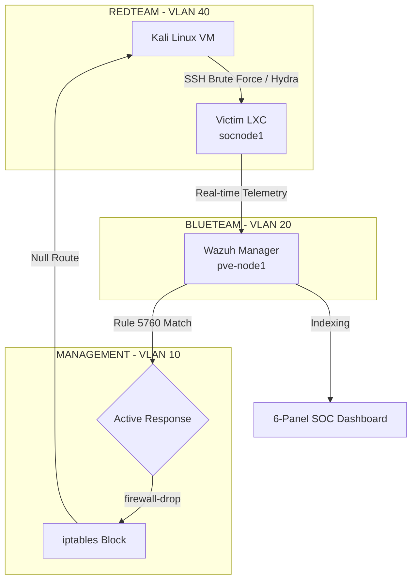

# 🛡️ Sentinel-SOC-Automation


**Production-grade Automated Incident Response (AIR) pipeline. This repository documents the architecture of a 60-minute "Zero to Shield" SOC deployment, featuring sub-second detection, automated firewall orchestration, and enterprise-grade infrastructure segmentation.**

> **MTTD:** < 1 Second | **MTTR:** < 1 Second | **Status:** Verified Operational

---

## 🏗️ The Philosophy: Blue Team Architecture
I am a Blue Team Infrastructure Engineer and Cloud Architect. The goal of this workshop project is not to "hack," but to build foundations so resilient that the attack is neutralized before the operator can even respond. 

This project leverages **AI-Driven Threat Validation**. I utilized generative AI as a technical consultant to source industry-standard attack vectors (Hydra/FIM) to stress-test this defensive architecture. This "Purple Team" approach ensures that the infrastructure I build is validated against real-world adversarial behavior.

---

## 🖥️ Physical Hardware (The "Iron")
The lab is hosted on an enterprise-grade high-availability cluster, designed for physical fault tolerance and high-fidelity telemetry ingestion.

| Component | Specification | Role |
| :--- | :--- | :--- |
| **PVE-Node1** | Dell OptiPlex 7040 | Proxmox HA Host (Wazuh Manager) |
| **PVE-Node2** | Dell OptiPlex 7040 | Proxmox HA Host (Attack Nodes) |
| **PVE-Node3** | Dell OptiPlex 7040 | Proxmox HA Host (Victim Nodes) |
| **CPU** | Intel Core i5/i7 (Skylake) | Virtualization & Log Processing |
| **Memory** | 16GB DDR4 RAM per Node | Distributed Cluster Memory |
| **Storage** | 512GB SATA HDD per Node | Indexer Persistence & OS Boot |
| **Switch** | TP-Link TL-SG108E | Managed Gigabit Switch (VLAN Tagging) |
| **Router** | TP-Link ER7206 | Wired VPN Router (Network Gateway) |
| **Secondary** | TP-Link AC750 Travel Router | Isolated Out-of-Band Management |

## 📐 Pipeline Architecture



## 🏗️ Deep Infrastructure & Node Configuration

The cluster is built on a **3-node Proxmox VE (PVE) High-Availability stack**, ensuring that the SOC remains operational even during physical node failure.

### **Compute Resource Mapping**
| Node Name | Physical Host | Allocation | Primary Role |
| :--- | :--- | :--- | :--- |
| **pve-node1** | Dell 7040 | 4 vCPU / 8GB RAM | Wazuh Manager & Indexer |
| **pve-node2** | Dell 7040 | 2 vCPU / 4GB RAM | RedTeam Simulation (Kali) |
| **pve-node3** | Dell 7040 | 2 vCPU / 2GB RAM | BlueTeam Workloads (LXC) |

### **Networking Stack**
* **Core Gateway:** TP-Link ER7206 Wired VPN Router handling inter-VLAN routing and hardware-level firewalling.
* **Switching:** TP-Link TL-SG108E (Layer 2 Managed) performing 802.1Q VLAN tagging for traffic isolation.
* **Out-of-Band (OOB):** TP-Link AC750 Travel Router providing a dedicated, isolated recovery path for the PVE management interfaces.
```

---

## 🌐 Logical Network Segmentation (The "Wire")
Security starts at Layer 2. This environment utilizes **VLAN-based isolation** to ensure attack traffic never touches management interfaces.

* **VLAN 10 (Management):** Wazuh Manager (192.168.10.X) & Management Devices (Admin Laptop/Workstation).
* **VLAN 20 (BLUETEAM / Victim):** Targeted Linux LXCs - High-fidelity monitoring.
* **VLAN 40 (REDTEAM / Isolated attack Zone):** Kali Linux VM - No egress allowed to other lab segments.

## 🛠️ The Software Sentinel Stack
| Layer | Technology | Function |
| :--- | :--- | :--- |
| **Hypervisor** | Proxmox VE 8.x | High-Availability Cluster Orchestration |
| **SIEM/XDR** | Wazuh v4.7 | Centralized Log Ingestion & Rule Engine |
| **IPS/IDS** | Wazuh Active Response | Automated `iptables` Firewall Mitigation |
| **Simulation** | Kali Linux | Attack Vector Source (Hydra, FIM triggers) |
| **Automation** | Bash / XML | Custom Rule Logic & Response Triggering |

---

## 🛡️ Phase 1: Automated Detection Logic
The Sentinel monitors for **Credential Abuse** and **Filesystem Tampering** via real-time syscall interception.

### Active Response Configuration (`ossec.conf`)
The following logic triggers an immediate network-layer block upon detecting a Level 12 SSH brute-force event.

```xml
<active-response>
  <command>firewall-drop</command>
  <location>local</location>
  <rules_id>5760</rules_id>
  <timeout>60</timeout>
</active-response>
```

---

## 🧪 Verified Attack Vectors
These commands are pre-written to save time during the workshop and were sourced via AI-led threat modeling.

* **SSH Brute Force (Hydra):** `hydra -l root -p 123 10.0.10.21 ssh -t 4`
* **Unauthorized Access:** `cat /etc/shadow`
* **Filesystem Tampering:** `touch /root/unauthorized_file.txt`

---

## 🤖 Engineering Logic: AI-Leveraged Threat Modeling
As a Blue Team Architect, I use AI tools (Gemini/LLMs) not to find answers, but to generate **Adversarial Test Cases**.
* **Requirement:** Validate the efficacy of the `firewall-drop` response against high-frequency authentication abuse.
* **AI Application:** Sourced industry-standard `hydra` flags to simulate a "Low and Slow" vs "High Volume" brute force.
* **Result:** Confirmed that the default Wazuh rule-tuning successfully catches the `-t 4` thread volume, ensuring the platform is resilient against automated script attacks.

---

## 📊 Incident Log Recap (Verified 2026-04-15)
| Event | Rule ID | Level | Mitigation |
| :--- | :--- | :--- | :--- |
| Failed SSH Login | 5710 | 5 | Logged |
| **Brute Force Detected** | **5760** | **12** | **Firewall Drop Executed** |
| Host Restored | 607 | 3 | Block Timeout Expired |

---

## 🚀 Step-by-Step Recreation Guide

### 1. The "Priming" Strategy
**Concept:** Wazuh's indexer only creates fields once it sees data. To build a dashboard, you must "prime" the index.
* **Action:** Immediately after agent deployment, run `cat /etc/shadow` on the Victim node.
* **Result:** This forces Rule 5402 to fire, populating the `rule.id`, `rule.level`, and `full_log` fields in the indexer, allowing for seamless dashboard creation.

### 2. Building the Command Center
Navigate to **Wazuh > Visualize** and configure the "Trio" SOC view:
1. **Area Chart:** Y-Axis: `Count` | X-Axis: `Date Histogram` (`@timestamp`).
2. **Donut Chart:** Y-Axis: `Count` | Bucket: `Terms` (`rule.level`).
3. **Forensics Table:** Columns: `rule.description`, `rule.id`, `srcip`, and `location`.

### 3. Deploying the Automated Shield
Add the Active Response binding to the Manager's `/var/ossec/etc/ossec.conf`.
* **Logic:** When Rule 5760 (Multiple SSH Failures) is triggered, execute `firewall-drop` on the local agent for 60 seconds.
* **Validation:** Observe the "Host Blocked" event in the `wazuh-alerts` index and confirm the Attacker IP is null-routed via `iptables -L`.

---

## 🤝 Connect & Dig Deeper
If you want to see the enterprise-scale version of this (Kubernetes, HA Clusters, GitOps), visit my primary repos:

* [`security-sentinel`](https://github.com/brypreez/security-sentinel) - K8s Automated Active Response Response & Alert System.
* [`homelab`](https://github.com/brypreez/homelab) - Infrastructure-as-Code (Terraform/Ansible).

**Contact:** [Bryan Perez on LinkedIn](https://www.linkedin.com/in/bryanperez) | **Organization:** CyberSentinels at Miami Dade College.

*Everything here is verified operational. Build, Test, Defend.*

---
## ⚖️ License
Distributed under the MIT License. See `LICENSE` for more information.
